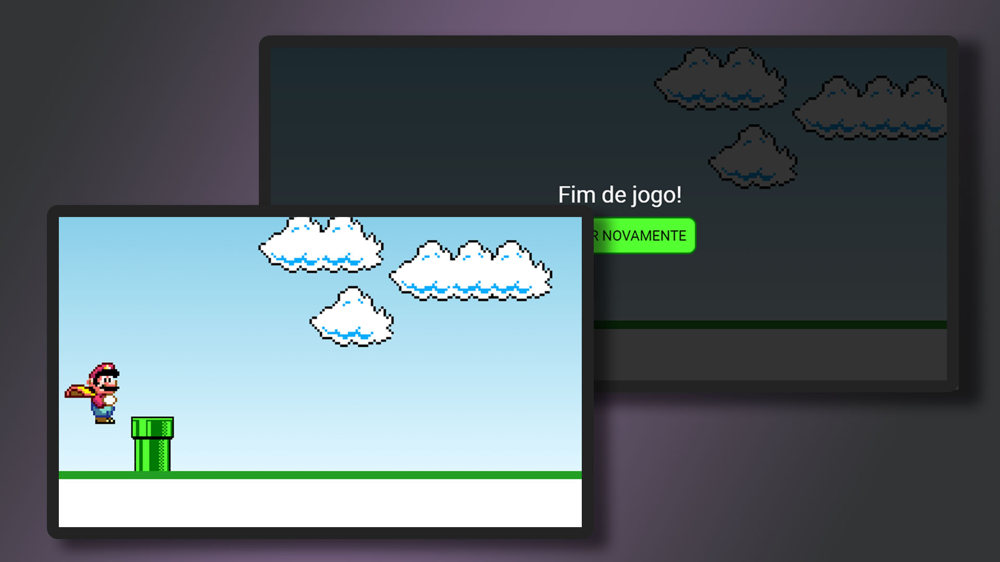

# jump-game

<h1 align="center"> Avatar Game Jump </h1>

O clássico jump game desenvolvido para navegadores.

 

  

## 🚀 Tecnologias

Esse projeto foi desenvolvido com as seguintes tecnologias:

- HTML e CSS
- JavaScript
- Git e Github

## ☝️ Desenvolvimento

De forma enxuta, o jogo foi desenvolvido para ser utilizado em computadores através do navegador, tendo seu primeiro versionamento inspirado no canal "Manual do Dev".
Com imagens e gifs, o uso de keyframes e funções foi primordial para animar e calcular distâncias, permitindo sua jogabilidade.